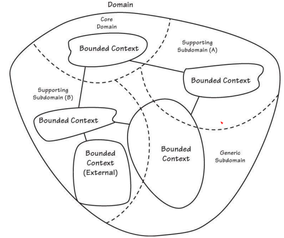
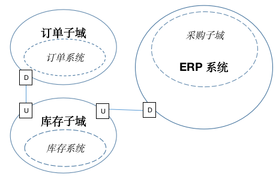

# 领域驱动设计之学习感悟（一）

接触领域驱动设计的概念，已有4年了。从看书了解的纯理论，到实际项目应用中遇到建模问题的思考，逐渐提升了建模能力。正好碰到2020年五一放假，想趁这个机会，写一下我的学习感悟。

## 什么情况下需要引入领域驱动设计

公司内的业务沉淀达到一定量，现有老系统维护困难，这个时候，有必要引入领域驱动设计，在这里简称DDD。

产品经理的业务设计和最终产品实现出入比较大，往往功能看似一样，实质在业务变更时会难以实现。解决办法是让产品经理参与进来，在软件建模期间和开发人员保持一致，以降低最终实现和业务设计的差异。

后续会分别从了解领域的概念、领域建模，到实战开发，逐步讲解清楚。

## 领域（Domain）

我理解为是所处的行业，譬如电商行业、制造业、运输业，等等等等。也可以是细分的，如零售行业、汽车制造行业。那么这些，可以称之为领域。

## 解决方案空间（Solution Space）、问题空间（Problem Space）

在特定领域下，通过产品经理和业务人员的共同努力，针对面临的业务问题，进行解决。已解决的部分，就是解决方案空间（需求）；尚未解决的，就是问题空间（潜在需求）。

对于领域专家（产品经理）的职责：

- 1）和业务人员一起，针对公司业务战略方向，符合公司当前、乃至未来发展方向决策，制定具体业务；或者针对现有面临的业务问题，进行业务调整；

- 2）就已制定的业务，对开发人员进行初步业务讲解；

- 3）开发人员建模期间，帮助开发人员深入了解业务；对于开发人员提出确实不合理或权衡下来很难实现或开发成本高的地方，协商调整，从而确保最终出来的软件，能符合制定业务的初衷。

对于开发人员的职责：

- 1）和领域专家参与业务讨论，并对领域进行建模；

- 2）对于不合理的，或有更好提议，可以提出来，帮助领域专家，完善业务；

- 3）按领域建模，进行业务开发；

- 4）非功能性需求实现：稳定性、可用性、可伸缩性。

## 子域（Subdomain）、通用子域（Generic Subdomain）、支撑子域（Supporting Subdomain）、核心域（Core Domain）

`子域`：在解决方案空间中，将领域细分成各个子业务，每个子业务称之为子域。

`通用子域`：对于和业务关联性不大的子域，具有可替代性的，称之为通用子域。如权限管理系统，初期可以通过购买产品以节省人力成本。

`支撑子域`：子域之间，存在一个依赖关系，作为当前子域的上游子域，称之为支撑子域。如产品目录子域，是订单子域的支撑子域。

`核心域`：对于公司，具有核心竞争力的业务，对应的子域，即为核心域。公司发展的不同时期，核心域也会随之改变。（原来的核心域，可能会变成新的核心域的支撑子域）

## 限界上下文（Bounded Context）

`限界上下文`：一个应用、系统，称之为限界上下文。如erp系统，就是个限界上下文。老的erp系统改造前，会涵盖所有子域。经过按子域进行剥离后，被剥离的子域，将拥有独立的限界上下文。如erp里的订单模块、商品管理模块、仓库管理模块。被剥离后，变成订单系统、商品中心、仓库管理系统。

## 通用语言（Ubiquitous Language）

`通用语言`：在当前限界上下文，建模时沟通用的语言，称为通用语言，是开发人员与领域专家（产品经理就是）之间的桥梁。如同大家坐在一起讨论特定主题时，都是围绕主题发言，涉及的名词也是在这个语境下进行，不会产生理解分歧问题。

通用语言中使用的名词，一般由行业专业术语 + 公司特有业务术语组成；仅作用于当前的限界上下文，具有无歧义性的特点；用于描述业务对象属性及行为、业务场景。

## 限界上下文映射（Bounded Context Map）

`限界上下文映射`：多个限界上下文之间存在交互，为了直观表达之间的关系，我们需要一张系统交互关系图，来表达上下游之间的关系，这就是限界上下文映射。

我将分别按组织模式、集成模式，进行讨论。此处的限界上下文的集成，我们可以简称为系统集成。

### 组织模式

组织模式，即团队间的关系。上下游团队配合度高的组织，就当前限界上下文而言，自然集成的代价是最小的。

- 合作关系（Partnership）：团队之间，荣辱与共，利益关系为一个整体。这种团队关系，是最容易做系统集成的。

- 共享内核（Shared Kernel）：将模型和代码进行共享，用于团队之间。优点是通过代码集成，集成相对容易；缺点是一旦改动，需要相关的团队都要参与讨论确定后才可以修改，耦合度比较高。

- 客户方-供应方开发（Customer-Supplier Development）：上游团队独立于下游团队完成开发，此时下游团队的开发会受限制。解决办法是在上游团队开发期间，有预见性的将下游开发的依赖需求考虑在内，并列入开发计划。

- 遵奉者（Conformist）：上游团队无动力去为满足下游团队进行的维护开发工作。即便处于利他主义考虑，而作出了种种承诺，可能难以一一兑现，导致下游团队开发处于被动状态。

### 集成模式

- 防腐层（Anticorruption Layer）：在当前领域模型中，封装对上游系统使用的一个翻译层，当前系统通过这个翻译层与上游系统交互。当组织模式可以顺利通过 `合作关系`、`共享内核`、`客户方-供应方开发` 进行合作开发的时候，所做的翻译层将会很轻松；否则，会比较艰难。防腐层，还可以通过引入必要的数据同步，解决因上游系统的不可用，导致当前系统不可用的问题。

- 开放主机服务（Open Host Service）：通过定义一种协议，并公开给需要与之集成的下游系统，作为系统间通讯方式。如WCF、Web API、MQ。

- 发布语言（Published Language）：将当前限界上下文中的概念，转换为整个领域下的全局概念，便于集成方系统理解。一般配合 `开发主机服务` 一起使用。

- 另谋他路（SeparateWay）：如果2套系统没有关联性，完全可以做到解耦，那么就没必要集成，毕竟集成的代价总是昂贵的。

- 大泥球（Big Ball of Mud）：当前系统包含了多个领域模型，模型之间界限很模糊、耦合度高。面对这类系统，如果要与之集成，则应从这个系统的边界作为整体来考虑，不要试图尝试对内部进行划分。如果有计划考虑重构系统，对包含的多个模型，进行剥离，那么待独立出新的系统后，再重新做集成，这个是可取的。

## 架构

## 实战演练

用我熟悉的电商领域中的库存子域作为核心域，来列举几个业务场景：

- 1）用户下单后，通知库存子域去冻结订单库存；超时1小时未付款的，则自动取消订单，并解冻订单库存

- 2）将相同订单来源、收货人姓名、收货人手机号、收件人地址的订单，合并成一张出货单，以降低发货成本

- 3）出货单，按照订单付款时间，依次占用仓库库存

    - a）如果库存够，则订单转为出库中；仓库的拣货区库存充足时，出货单转为待下货，对应的订单商品解冻订单库存；仓库拣货区库存不足时，出货单转为待调拨，订单库存保持冻结状态
    
    - b）如果库存不够，则订单状态仍为待出库，出货单则转为待采购，并通知采购子域，缺货的商品及数量

- 4）将发货商品一样的，或发货商品所在同一个拣货子区域的出货单，合并成一张拣货总单，以提高拣货效率

- 5）仓库拣货人员在拣货区域，按照拣货总单上的单号、存放商品的盒子条码进行下货，并告知拣货总单下的各个出货单需拣货的数量，完成多个出货单的拣货过程。

根据以上的业务场景描述，可以看出，存在3个子域：订单子域、库存子域、采购子域。其中库存子域是核心域，订单子域、采购子域，作为支撑子域。

这3个子域，对应3个限界上下文子域之间的上下游关系：

库存子域  U <--> D 订单子域

库存子域  U <--> D 采购子域

好了，这篇讲了DDD的战略内容大部分，之所以先将这些，是因为这些是开发人员和产品经理都应该知道的，而且能大致了解DDD里都有哪些东西。

下一篇，会从DDD战术角度来说明。
