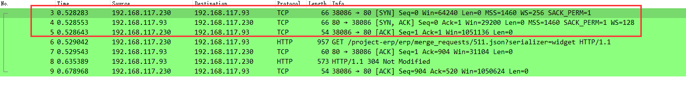
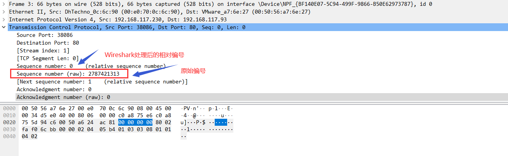
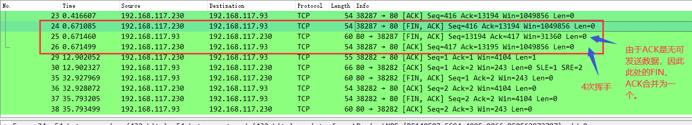

# TCP三次握手和四次挥手

## TCP三次握手

- 主动连接方建立连接，状态为SYN_SEND，发送报文，标记【SYN】，seq=2787421313；
- 被动连接方接收报文，状态为SYN_RECV，发送报文，标记【SYN, ACK】，seq=2794366626，ack=2787421314；
- 主动连接方接收报文，此时客户端处于ESTABLISHED状态，然后发送报文，标记【ACK】，seq=2787421314，ack=2794366627；
- 被动连接方接收报文，此时服务端也处于ESTABLISHED状态。

备注：

1）seq序号，为32bit的数字，为ISN（InitialSequenceNumber），每次获取都会+1，当超过2**32之后，会重置为0；

2）TCP报文中，仅在有ACK标志位，才可以ack计数，ack计数值为接收到的报文中seq+1。

## TCP四次挥手

- 主动断开方要断开连接，状态为FIN_WAIT-1，发送报文，标记【FIN ACK】，seq=5973，ack=6403；
- 被动断开方接收报文，状态为CLOSE_WAIT，发送报文，标记【ACK】，seq=6424，ack=5974；
- 主动断开方接收报文，状态为FIN_WAIT-2；
- 被动断开方，状态为CLOSE，发送报文，标记【FIN ACK】，seq=6427, ack=5974；
- 主动断开方接收报文，状态为TIME_WAIT，发送报文，标记【ACK】，seq=6002，ack=6428；
- 被动断开方接收报文，状态为CLOSED；
- 主动断开方，等待2MSL时间后，状态也为CLOSED。

备注：

1）seq序号，为32bit的数字，为ISN（InitialSequenceNumber），每次获取都会+1，当超过2**32之后，会重置为0；

2）TCP报文中，仅在有ACK标志位，才可以ack计数，ack计数值为接收到的报文中seq+1；

3）被动断开方发送的【ACK】和【FIN ACK】的2条报文，如果期间没有可发送的数据，则2条报文合并为一个，【FIN ACK】；

4）主动断开方处于TIME_WAIT时，会等待2倍的MSL（Maximum Segment Lifetime，报文段在网络上能存活的最大时间），过了这个状态，才会CLOSE，释放套接字文件描述等资源。

​    